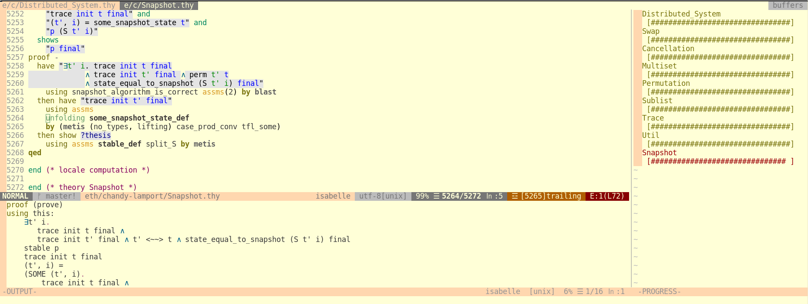

# isabelle.vim

Supporting plugin for [`coc-isabelle`](https://github.com/ThreeFx/coc-isabelle).
It defines the dynamic syntax highlighting groups used by coc-isabelle, as well
normal Isabelle/Isar syntax.

This plugin can technically be used standalone, however it will only provide
static syntax highlighting and symbol substitution. In order to take full
advantage of the Isabelle/VSCode language server (which is only called VSCode,
it is a generic language server), you have to use `coc-isabelle`.

## Installation

Install it using your favorite vim package manager:

```
Plug 'ThreeFx/isabelle.vim'
```

## Configuration

```
|Variable|Default|Description|
|g:isabelle_output_height|10|Height of the Isabelle output window|
|g:isabelle_process_width|40|Height of the Isabelle process window|
```

## Screenshots


